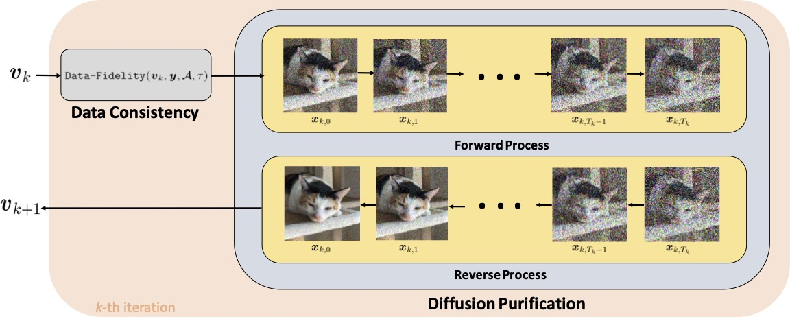

# Decoupled-Data-Consistency-with-Diffusion-Purification-for-Image-Restoration



**Decoupled-Data-Consistency-with-Diffusion-Purification-for-Image-Restoration**<br>
Xiang Li, Soo Min Kwon, Ismail R. Alkhouri, Saiprasad Ravishankar, Qing Qu
<br>https://arxiv.org/abs/2403.06054<br>

Abstract: *Diffusion models have recently gained traction as a powerful class of deep generative priors, excelling in a wide range of image restoration tasks due to their exceptional ability to model data distributions. To solve image restoration problems, many existing techniques achieve data consistency by incorporating additional likelihood gradient steps into the reverse sampling process of diffusion models. However, the additional gradient steps pose a challenge for real-world practical applications as they incur a large computational overhead, thereby increasing inference time. They also present additional difficulties when using accelerated diffusion model samplers, as the number of data consistency steps is limited by the number of reverse sampling steps. In this work, we propose a novel diffusion-based image restoration solver that addresses these issues by decoupling the reverse process from the data consistency steps. Our method (DCDP) involves alternating between a reconstruction phase to maintain data consistency and a refinement phase that enforces the prior via diffusion purification. Our approach demonstrates versatility, making it highly adaptable for efficient problem-solving in latent space. Additionally, it reduces the necessity for numerous sampling steps through the integration of consistency models. The efficacy of our approach is validated through comprehensive experiments across various image restoration tasks, including image denoising, deblurring, inpainting, and super-resolution.*

## Getting started

### 1) Clone the repository

```
git clone https://github.com/Morefre/Decoupled-Data-Consistency-with-Diffusion-Purification-for-Image-Restoration.git

cd Decoupled-Data-Consistency-with-Diffusion-Purification-for-Image-Restoration
```
### 2) Set Environment

```
conda create -n DCDP python=3.8

conda activate DCDP

pip install -r requirements.txt

pip install torch==1.11.0+cu113 torchvision==0.12.0+cu113 torchaudio==0.11.0 --extra-index-url https://download.pytorch.org/whl/cu113
```
We need to download the following code to implement the forward operator for motion-blurring and nonlinear-blurring

```
git clone https://github.com/VinAIResearch/blur-kernel-space-exploring bkse

git clone https://github.com/LeviBorodenko/motionblur motionblur
```
For nonlinear-blurring, we need to download the "GOPRO_wVAE.pth" file from [here](https://drive.google.com/file/d/1vRoDpIsrTRYZKsOMPNbPcMtFDpCT6Foy/view) and paste it to ./bkse/experiments/pretrained/

### 3) Prepare Pretrained Diffusion Model Checkpoints
For experiments on FFHQ and ImageNet, we use the pretrained weights provided in [here](https://github.com/DPS2022/diffusion-posterior-sampling.git). Download the "ffhq_10m.pt" and "imagenet_256.pt" files and place them in the ./models/ folder

For experiments on LSUN-Bedrooms, we use the pretrained weights provided in [here](https://github.com/openai/guided-diffusion.git). Download the "lsun_bedroom.pt" file and place it in the ./models/ folder

### 4) Preapare Datasets
The FFHQ dataset can be downloaded from [here](https://www.kaggle.com/datasets/denislukovnikov/ffhq256-images-only). Move the downloaded images to the ./data/ffhq/ folder, where we've already provided the first 5 images

For the setup of LSUN-Bedroom and ImageNet dataset, please refer to this [repository](https://github.com/openai/guided-diffusion.git)

### 5) Inference

```
Nonlinear deblur
python dcdp.py --task_config=./task_configurations/nonlinear_deblur_config.yaml --purification_config=./purification_configurations/purification_config_nonlinear_deblur.yaml \
                 --model_config=./model_configurations/model_config_ffhq.yaml 
```

```
Phase Retrieval
python dcdp.py --task_config=./task_configurations/phase_retrieval_config.yaml --purification_config=./purification_configurations/purification_config_phase_retrieval.yaml \
                 --model_config=./model_configurations/model_config_ffhq.yaml 
```

```
# Inpainting
python dcdp.py --task_config=./task_configurations/inpainting_config.yaml --purification_config=./configs/purification_config_inpainting.yaml \
                 --model_config=./model_configurations/model_config_ffhq.yaml 
```

```
# Motion deblur
python dcdp.py --task_config=./task_configurations/motion_deblur_config.yaml --purification_config=./purification_configurations/purification_config_motion_deblur.yaml \
                 --model_config=./model_configurations/model_config_ffhq.yaml 
```

```
# Gaussian deblur
python dcdp.py --task_config=./task_configurations/gaussian_deblur_config.yaml --purification_config=./purification_configurations/purification_config_gaussian_deblur.yaml \
                 --model_config=./model_configurations/model_config_ffhq.yaml 
```

```
# Super resolution
python dcdp.py --task_config=./task_configurations/super_resolution_config.yaml --purification_config=./purification_configurations/purification_config_super_resolution.yaml \
                 --model_config=./model_configurations/model_config_ffhq.yaml 
```

### 6) Update
* In our original paper we only perform experiments on linear image restoration problem. However, the dcdp algorithm achieves state of the art performance on nonlinear deblur and phase retrieval as well. For 100 FFHQ images, dcdp achieves an average PSNR of 29.19. For phase retrieval it achieves an average PSNR of 28.45. Additional experiment results will appear in our revised paper soon.

* Code for latent space diffusion model and consistency model will be uploaded soon.

* Our paper will be presented a the [IMSI Computational Imaging Workshop 2024](https://www.imsi.institute/activities/computational-imaging/).

## Reference
  * Our implementation is based on [DPS](https://github.com/DPS2022/diffusion-posterior-sampling.git).
  * We use the pretrained diffusion models developed by [Guided Diffusion](https://github.com/DPS2022/diffusion-posterior-sampling.git).

##  Contact

- Xiang Li, forkobe@umich.edu
